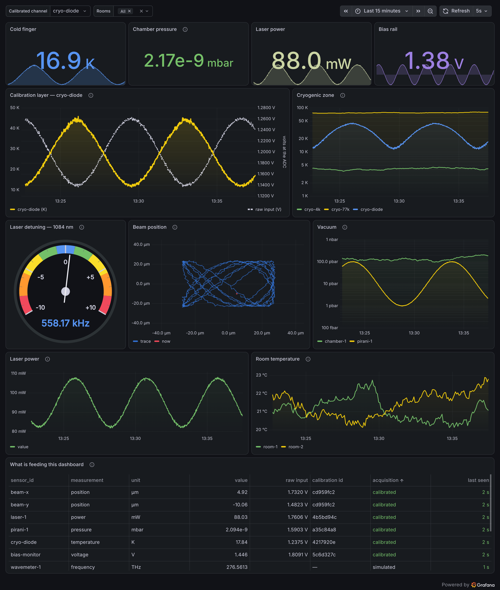
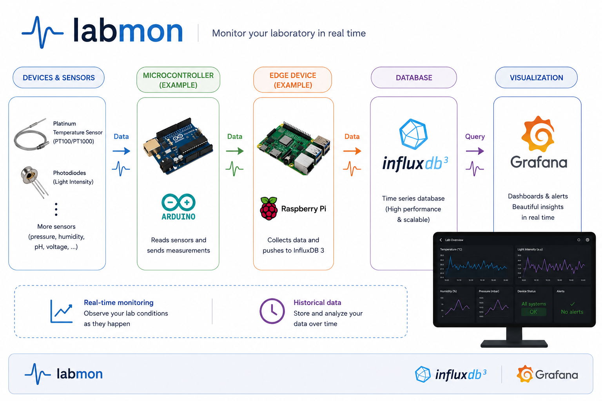

# labmon

[](LICENSE)
[](https://github.com/quentinmarolleau/labmon/pulls)
[](https://github.com/quentinmarolleau/labmon)
[](pyproject.toml)
[](https://github.com/quentinmarolleau/labmon/actions/workflows/ci.yml)
[](https://codecov.io/gh/quentinmarolleau/labmon)
[](https://github.com/DetachHead/basedpyright)
[](https://github.com/astral-sh/ruff)
[](https://github.com/quentinmarolleau/labmon)

**Know what your lab is doing — right now, and last Tuesday at 3 a.m.**

labmon records whatever your experiment produces (cryostat temperature,
chamber pressure, laser power, a magnet's current) into a time-series
database, and puts it on a live dashboard anyone in the room can open in
a browser. Two commands to start, no database or web experience needed.



*The **Lab Overview** dashboard you get out of the box, running against
the demo sensors that start automatically.*

## Contents

- [What labmon gives you](#what-labmon-gives-you)
- [Quickstart](#quickstart) — running in two minutes, no hardware needed
- [The dashboard](#the-dashboard) — what Grafana brings along
- [Connecting a real instrument](#connecting-a-real-instrument)
- [Running it across the lab](#running-it-across-the-lab)
- [How it works](#how-it-works)
- [Project structure](#project-structure)
- [Development](#development)
- [Status](#status)
- [Contributing](#contributing) · [License](#license)

## What labmon gives you

- **Live plots of anything you can measure.** Point a sensor at it, and
  the reading shows up on a dashboard that refreshes itself.
- **A permanent record.** Every reading is kept with its timestamp, so
  "was the cryostat stable overnight?" is a question you can answer
  afterwards instead of guessing.
- **Physical units, checked.** Calibration lives in a small text file:
  say that a channel reads `42.5 kelvin / volt` and labmon derives the
  result in kelvin — [dimensional analysis](https://pint.readthedocs.io/en/stable/)
  catches a mistake like adding millibars to kelvin before any data is
  recorded.
- **Alerts when something drifts.** Grafana can email or message you when
  a reading leaves the range you expect.
- **One dashboard for the whole room.** The database and dashboard run on
  one machine; instruments elsewhere in the lab push to it over the
  network, and anyone opens it in a browser.
- **Nothing to babysit.** Sensors keep sampling through a network hiccup
  or a server restart and catch up afterwards, rather than losing
  readings or dying.

Under the hood it is [InfluxDB 3](https://docs.influxdata.com/influxdb3/core/)
for storage and [Grafana](https://grafana.com/docs/grafana/latest/) for
visualization, wired together and pre-configured so neither needs setting
up by hand.

## Quickstart

You need [Docker](https://docs.docker.com/get-started/get-docker/). No
sensors, no hardware, nothing else.

```bash
cp .env.example .env   # fill in INFLUXDB_NODE_ID and INFLUXDB3_AUTH_TOKEN
docker compose up -d --wait
```

Open [http://localhost:3000](http://localhost:3000) and log in with
`admin` / `admin`.

Five simulated sensors — two room thermometers, two cryogenic sensors and
a vacuum gauge — start writing data immediately, so the dashboard is
already alive. They are there to explore with; see
[`docs/mock-sensor.md`](docs/mock-sensor.md) for how to add more or
change what they simulate, and [`docs/grafana.md`](docs/grafana.md) for
what the dashboard is made of.

Turning the simulated sensors off (for a real deployment) is a single
setting — see [`docs/deployment.md`](docs/deployment.md#demo-vs-server-compose_profiles).

## The dashboard

The front end **is** Grafana, not a thin imitation of it, so everything
Grafana can do is available immediately — labmon only supplies the data
and a starting dashboard. The parts most worth knowing about:

| What | Why it matters in a lab | Grafana docs |
|---|---|---|
| **Panels and visualizations** | Time series, gauges, histograms, heatmaps, state timelines — built by clicking, not by writing plotting code | [Panels and visualizations](https://grafana.com/docs/grafana/latest/panels-visualizations/) |
| **Explore** | Ad-hoc digging through the data without touching a saved dashboard — the "what actually happened at 03:14?" tool | [Explore](https://grafana.com/docs/grafana/latest/explore/) |
| **Alerting** | Notify by email, Slack, Telegram… when a reading leaves its expected range, or when a sensor goes silent | [Alerting](https://grafana.com/docs/grafana/latest/alerting/) |
| **Snapshots and sharing** | Freeze a dashboard as it looks now and send the link — useful for a logbook entry, a group meeting, or a paper draft | [Share dashboards and panels](https://grafana.com/docs/grafana/latest/dashboards/share-dashboards-panels/) |
| **Annotations** | Mark the moment you opened a valve or changed a setpoint, so the event sits on the plot next to its consequence | [Annotate visualizations](https://grafana.com/docs/grafana/latest/dashboards/build-dashboards/annotate-visualizations/) |
| **Variables** | One dashboard with a dropdown for "which cryostat?", instead of one dashboard per instrument | [Variables](https://grafana.com/docs/grafana/latest/dashboards/variables/) |

Dashboards you build in the browser can be exported as JSON and dropped
into `grafana/dashboards/` to become part of the repository — so a
dashboard someone perfected is version-controlled and comes back
automatically on a fresh install, rather than living only in one
browser's memory. [`docs/grafana.md`](docs/grafana.md) covers that, plus
the query syntax for new panels and a few sharp edges worth knowing.

## Connecting a real instrument

A sensor that outputs a voltage reaches labmon through a microcontroller
(an Arduino Due is the reference board) plugged into a USB port:

```
sensor ──voltage──► board's ADC ──USB serial──► serial-sensor ──► InfluxDB ──► Grafana
                                                     │
                                            calibration.toml
                                     (what a voltage means, per channel)
```

The board only ever sends **raw ADC counts**. What a count *means* lives
on the computer, in a small text file — so recalibrating never means
reflashing the board:

```toml
[channels.A0]
sensor_id = "cryo-77k"
measurement = "temperature"
conversion_factor = "42.5 kelvin / volt"
```

Real sensors are rarely that obliging, so five conversion modes are
available:

| Mode | For a response that is | You provide |
|---|---|---|
| `linear` | proportional | one dimensioned factor |
| `affine` | a straight line with an offset | factor and offset |
| `spline` | smoothly curved | measured points; a cubic is fitted |
| `piecewise_linear` | curved, with few points | measured points; straight segments between them |
| `expression` | a known formula | e.g. `10**(1.667*v - 11.33)` |

Every conversion is checked and trial-applied when the file loads, so a
typo or a dimensional mistake fails immediately with a clear message
rather than silently recording wrong numbers.

Start from [`calibration.example.toml`](calibration.example.toml), which
works through all five modes with realistic sensors, and read
[`docs/serial-sensor.md`](docs/serial-sensor.md) for the full picture —
including the reference Arduino sketch in
[`firmware/`](firmware/due_native_serial/due_native_serial.ino), giving
the board a stable device name, and testing the whole chain with a
virtual serial port before any hardware arrives.

> **Not yet verified on hardware.** The serial acquisition path has been
> tested end to end against a virtual serial port, but never against a
> physical Arduino Due. Check readings against a known voltage before
> trusting them.

## Running it across the lab

Everything above runs on one machine. A real lab is usually three roles
on a small network:

| Role | Runs | Setup |
|---|---|---|
| **Server** | InfluxDB + Grafana, on one always-on machine | [`docs/deployment.md`](docs/deployment.md) |
| **Clients** | A sensor script, on whatever machine the instrument is wired to (a Raspberry Pi, a lab PC) | [`docs/client-setup.md`](docs/client-setup.md) |
| **Viewers** | Just a browser | nothing to install |

A client can be a Docker container or a plain Python install — both are
documented, and a board can equally well be plugged straight into the
server, in which case there is no client machine at all.

Traffic is plain HTTP today, deliberately: it assumes a trusted lab
network, and the reasoning (plus what changes if that stops being true)
is written down in
[`docs/deployment.md`](docs/deployment.md#security-plain-http-by-design-for-now).

## How it works



Sensor scripts build one data point per reading and hand it to a
queue-backed writer, which batches points and sends them from a
background thread. That indirection is the reason a sensor never stalls:
a single write to InfluxDB costs about a second, because the database
waits until the data is safely on disk before answering. Batching turns
that into a millisecond per point, and the queue means the sampling loop
never waits for it at all — including through an outage, which is
retried with backoff instead of dropping data.
[`docs/latency.md`](docs/latency.md) has the measurements behind every
number in that paragraph.

Grafana reads the database through its SQL (Flight SQL) mode;
[`docs/grafana.md`](docs/grafana.md) explains that choice and how the
datasource and dashboards are provisioned automatically from files in
this repository.

## Project structure

- `src/labmon/` — application code
  - `influx.py` — shared InfluxDB client configuration
  - `writer.py` — queue-backed writer decoupling producers from InfluxDB I/O latency
  - `calibration.py` — turns raw ADC counts into dimensioned physical quantities
  - `sensors/` — sensor scripts (simulated, and real boards over serial)
- `firmware/` — reference Arduino sketches for boards labmon reads
- `tests/` — pytest suite
- `docs/` — usage docs per component
- `typings/` — local type stubs for untyped third-party dependencies
- `grafana/` — provisioned datasource and dashboards
- `Dockerfile` — builds labmon's own code for the containerized sensors
- `docker-compose.yml` — local InfluxDB, Grafana, and demo sensor instances
- `docker-compose.client.yml` — sensor-only compose file for a remote client machine
- `calibration.example.toml` — worked example of every sensor conversion mode
- `deploy/` — example systemd units for a bare-install client
- `CONTRIBUTING.md` / `AGENTS.md` — workflow, commit conventions, testing policy
- `BACKLOG.md` — planned/considered future work, roughly prioritized

## Development

Requires [uv](https://docs.astral.sh/uv/). The four checks CI enforces:

```bash
uv run pytest --cov=src --cov-report=term-missing --cov-fail-under=100
uv run ruff check .
uv run basedpyright
uv run typos
```

Test coverage is held at 100%, and basedpyright runs on its default
(strictest) preset with zero errors and zero warnings — see
[`CONTRIBUTING.md`](CONTRIBUTING.md) for the reasoning and the workflow.

## Status

Alpha, and honest about it: the software is tested and running, but the
serial acquisition path has never met a real Arduino Due. Everything
else — storage, dashboards, networking between machines, resilience — is
exercised daily against live services.

[`BACKLOG.md`](BACKLOG.md) tracks what is planned next, with effort
estimates and a suggested order. Near the top: a proper documentation
site, and TLS for deployments beyond a trusted LAN.

## Contributing

See [`CONTRIBUTING.md`](CONTRIBUTING.md) for the branch/PR workflow,
commit conventions, and testing policy (`AGENTS.md` is the condensed,
agent-oriented version of the same document).

## License

GPLv3 — see [LICENSE](LICENSE).
